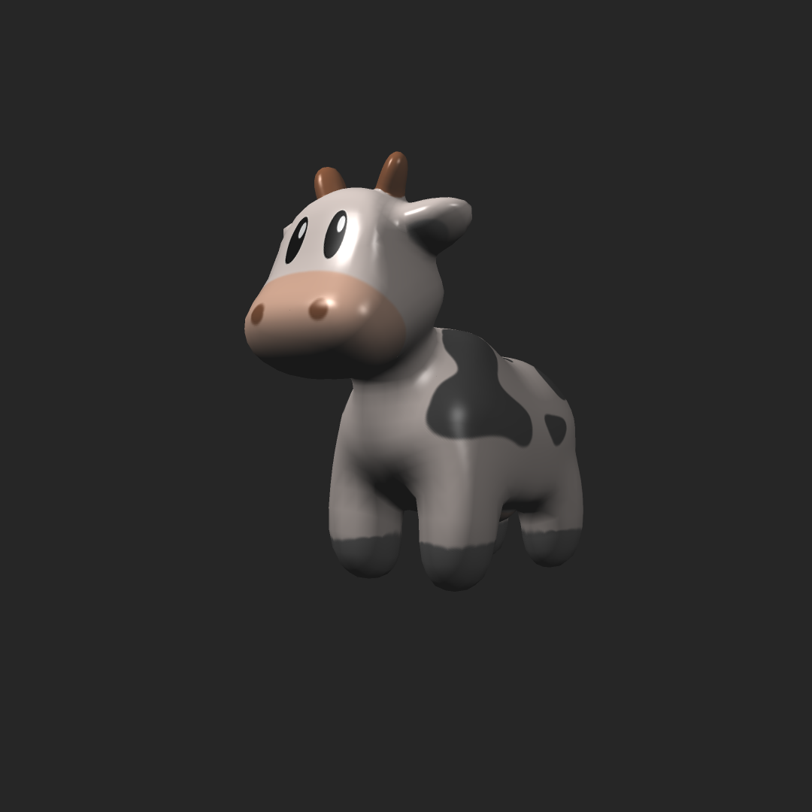
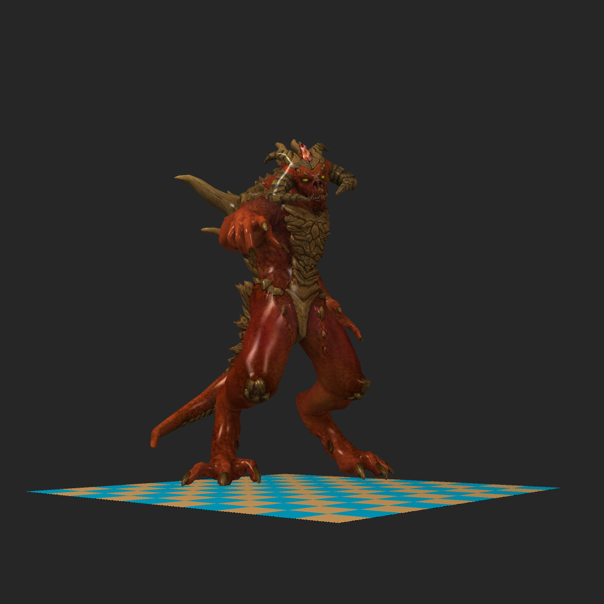
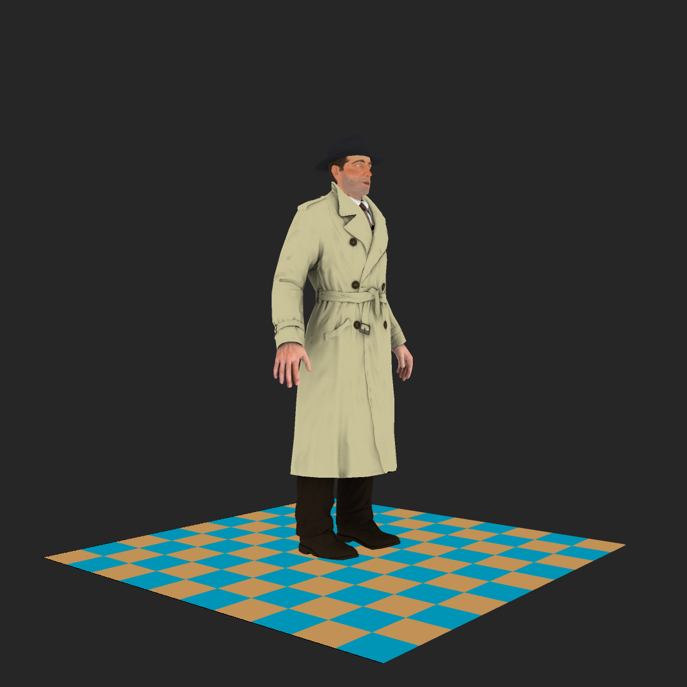
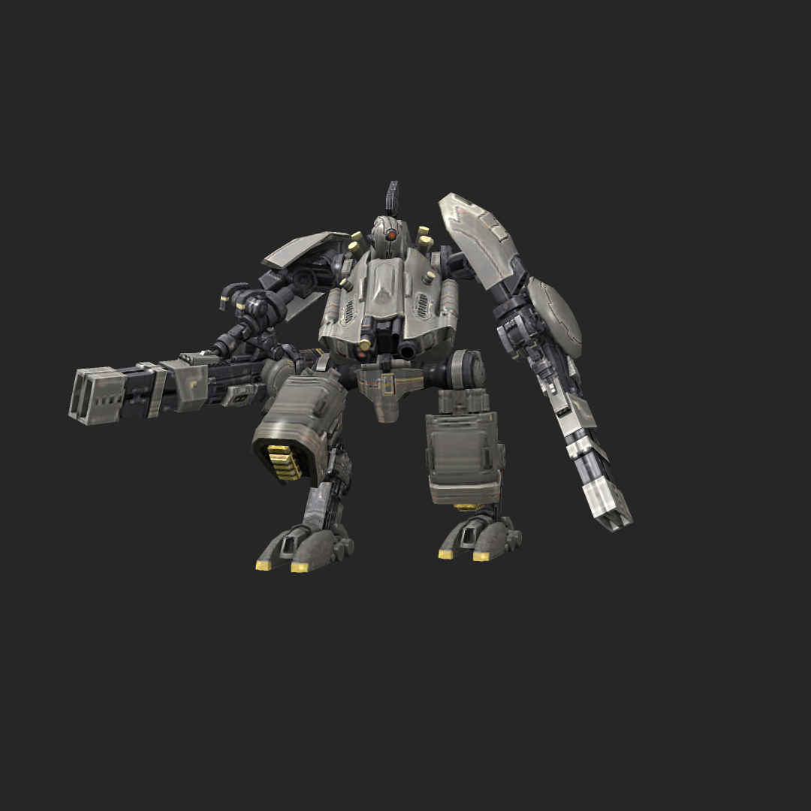
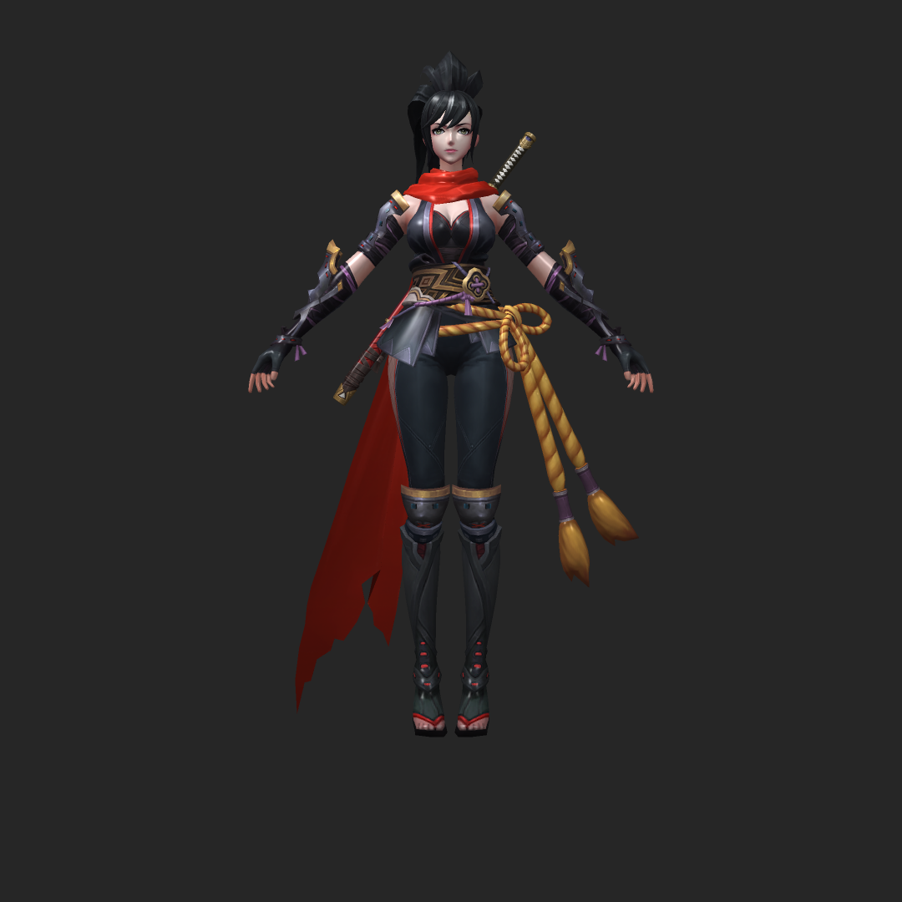

# AnyaRenderer
- ```AnyaRenderer``` 是一个迷你的软渲染器，目前实现了光栅化的功能，基于 C++20 开发.
- 实现了矩阵向量库，线性插值，z-buffe 深度检测， MSAA 抗锯齿等功能.

## Compile 
- MinGW w64 9.0
- Windows

## Build
- CMake VERSION 3.20

## Dependent
- GLFW
- nlohmann
- stb_image

## Screenshots
| Scene                                          | Description |
|------------------------------------------------|-------------|
|  | `Triangle`  |
|      | `MSAA`      |
|       | `Cow`       |
|   | `Elfgirl`   |
|     | `Azura`     |
|   | `Diablo3`   |
|    | `Boggie`    |
|     | `Robot`     |
|  | `Assassin`  |
|     | `Marry`     |
|     | `Kgirl`     |
