# AnyaRenderer
- ```AnyaRenderer``` 是一个迷你的软渲染器，目前实现了光栅化和 Whitted Style 风格的光线追踪的功能，基于 C++20 开发。
- 实现了矩阵向量库，线性插值，z-buffer 深度检测， MSAA 抗锯齿等功能。

## Development Environment
- Clion + MinGW w64 9.0
- Windows

## Build System
- CMake VERSION 3.20

## Dependent
- GLFW
- nlohmann
- stb_image

## Controls
- Move  : 按下 ```W``` ```S``` ```A``` ```D``` 前后左右移动
- Mouse: 鼠标水平移动影响偏航角，鼠标垂直移动影响俯仰角
- Scroll: 鼠标滚轮控制缩放
- Reset: 按下 ```SPACE``` 恢复默认位置
- Quit: 按下 ```ESC``` 退出程序

## Screenshots
### Models
| Scene                                            | Description |
|--------------------------------------------------|-------------|
| 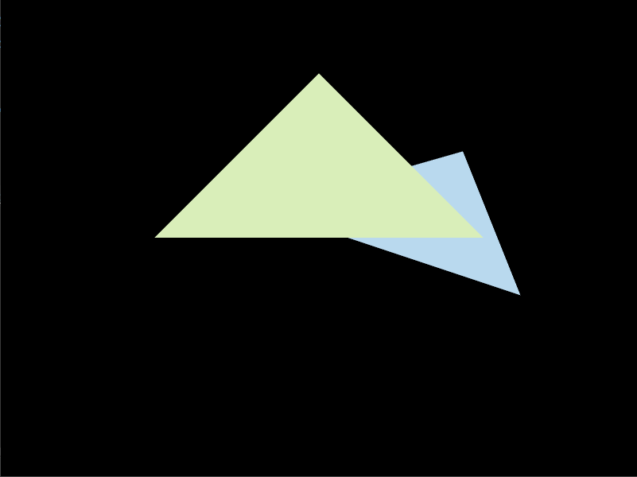 | `Triangle`  |
| 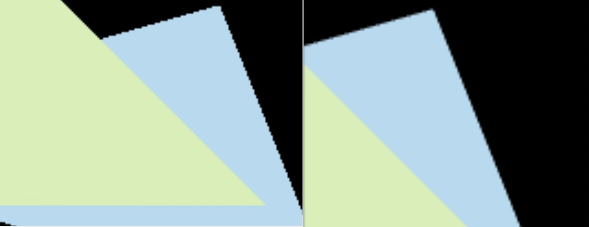     | `MSAA`      |
| 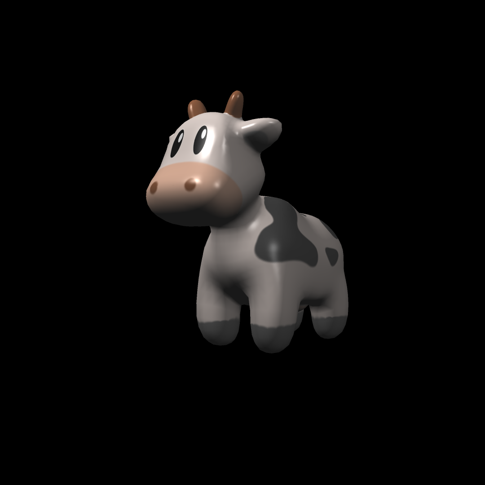      | `Cow`       |
| 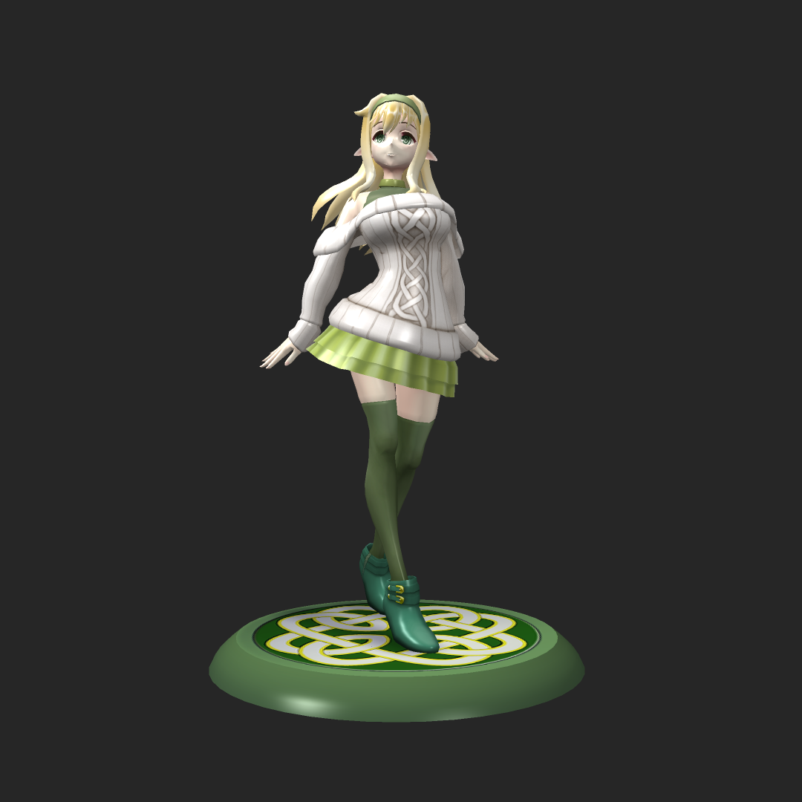  | `Elfgirl`   |
| 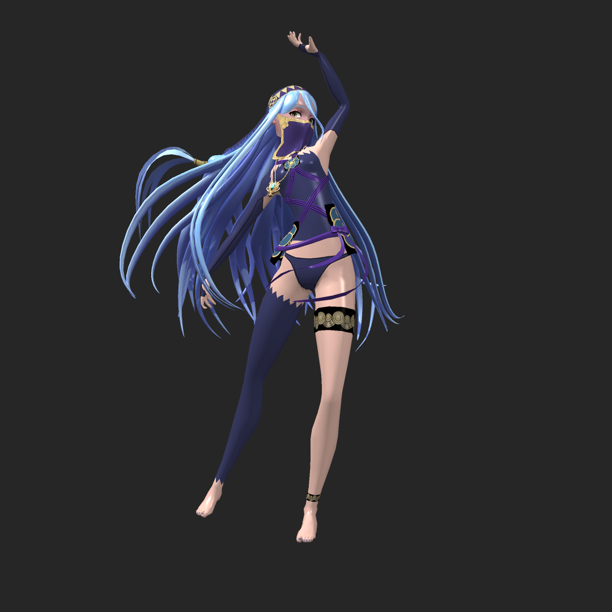    | `Azura`     |
| 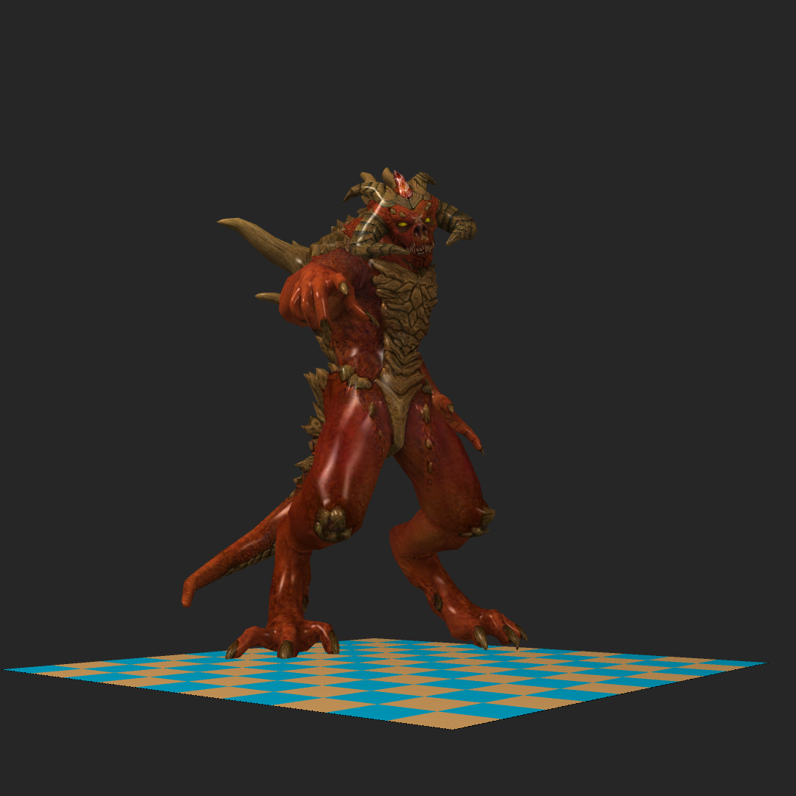  | `Diablo3`   |
| 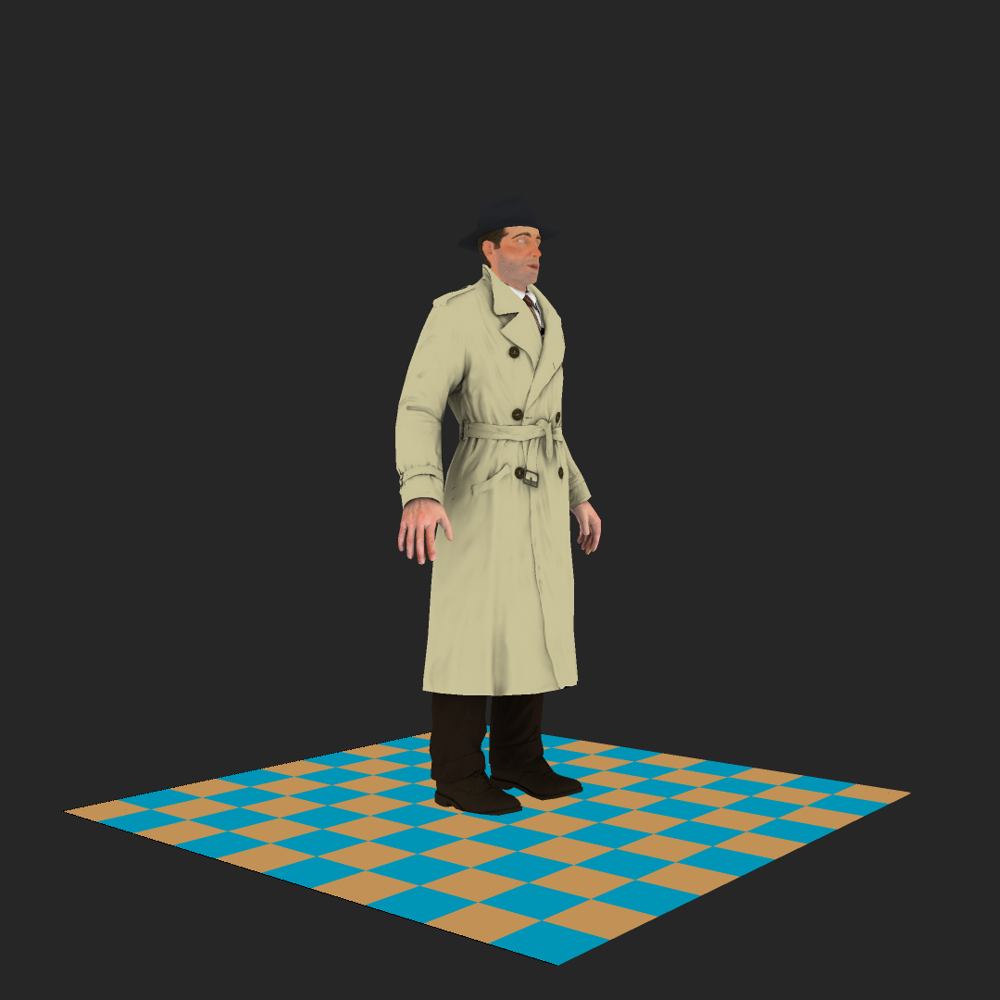   | `Boggie`    |
| 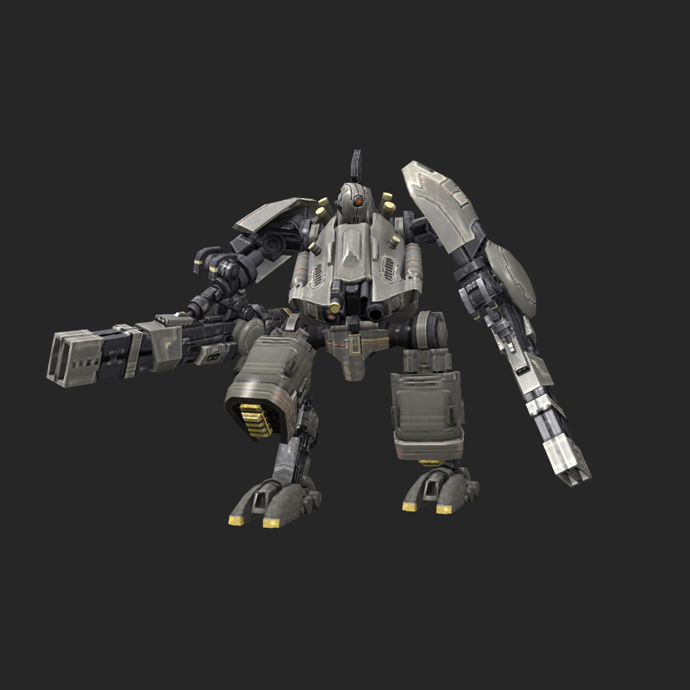    | `Robot`     |
| 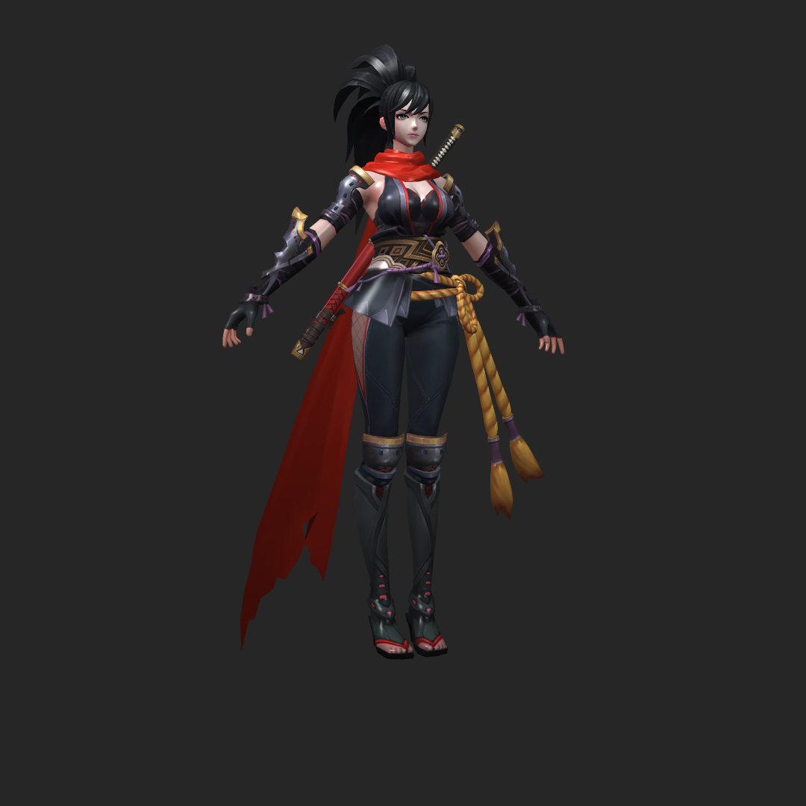 | `Assassin`  |
| 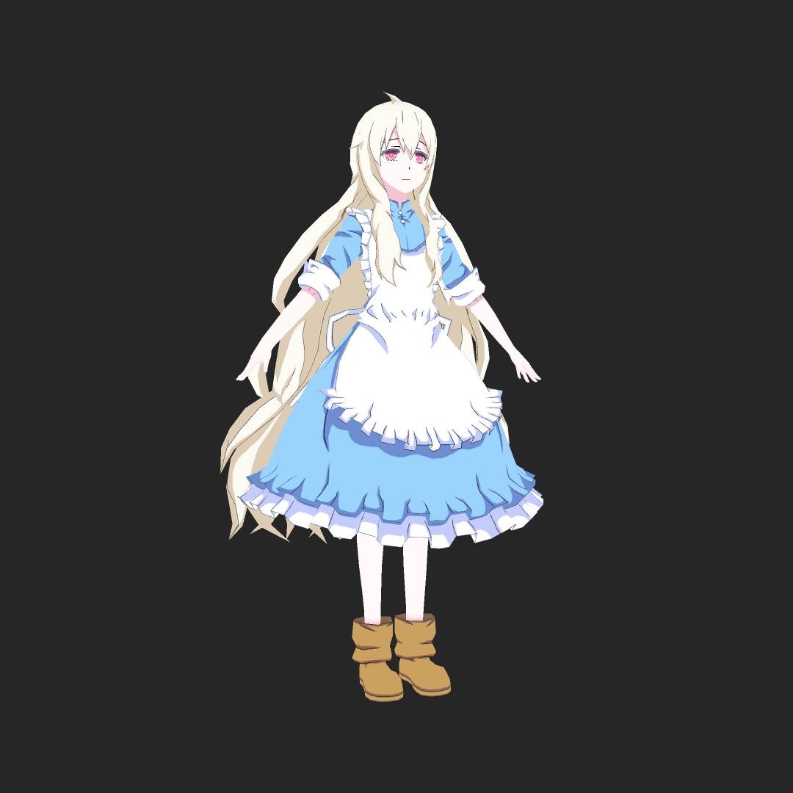    | `Marry`     |
| 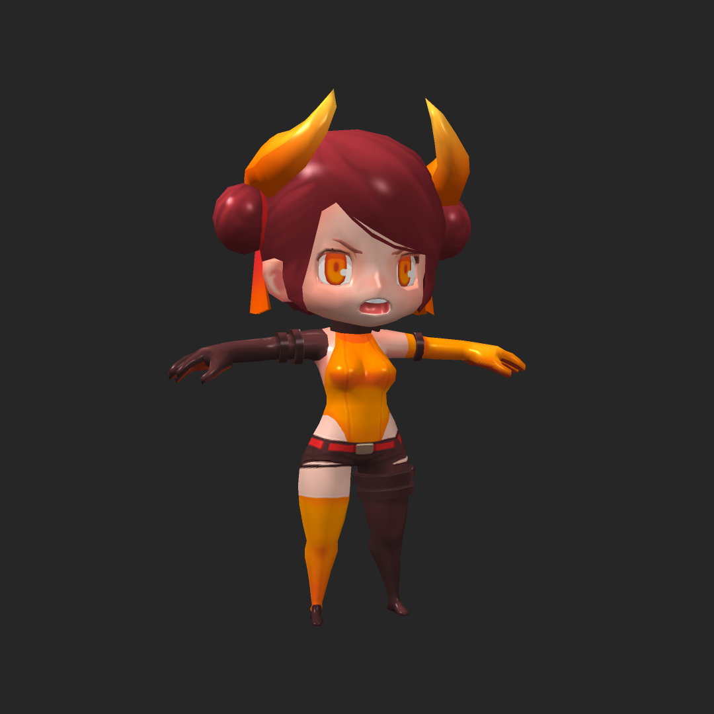    | `Kgirl`     |

### Environments
| Scene                                                 | Description     |
|-------------------------------------------------------|-----------------|
| 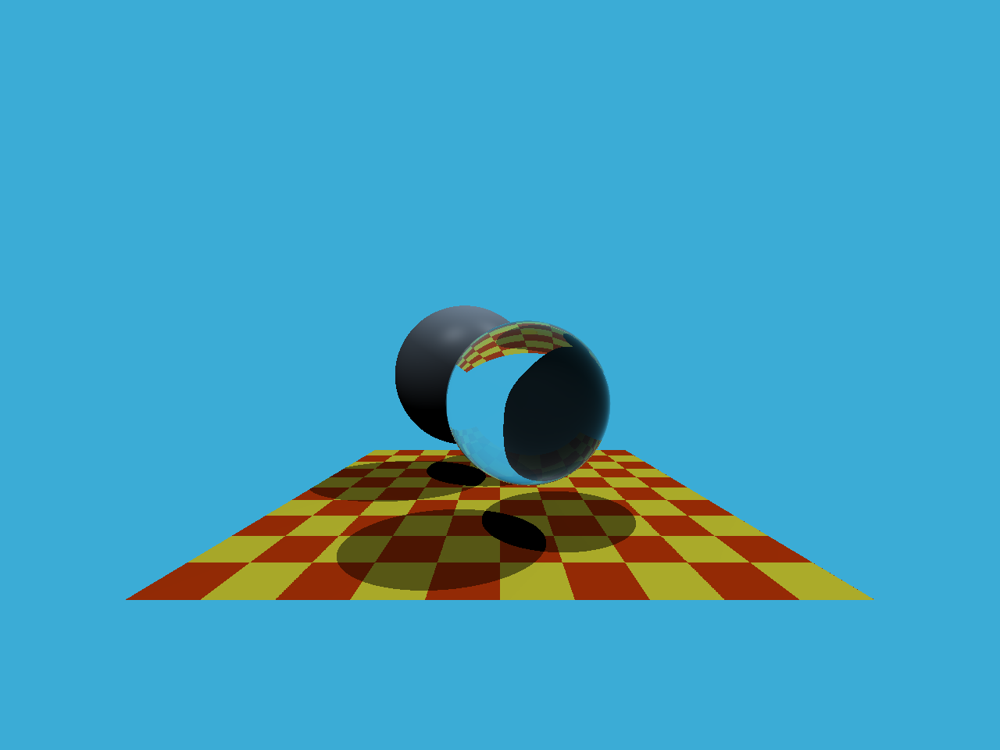 | `Whitted Style` |


## Feature
- [x] 数学
    - [x] 向量运算
    - [x] 矩阵运算
    - [x] 工具函数
- [x] 图元
    - [x] 球体
    - [ ] 矩形
    - [x] 三角形
    - [x] 模型
- [x] 纹理
    - [x] 单色纹理
    - [x] 图片纹理
    - [x] 凹凸纹理
    - [x] Bilinear双线性插值
- [x] 渲染
    - [x] 光栅化
    - [x] 光线追踪
    - [x] 着色器
    - [x] MSAA抗锯齿
- [ ] 加速结构
    - [ ] AABB包围盒
    - [ ] 层次包围盒
- [x] 相机系统
  - [x] 水平移动
  - [x] 俯仰角
  - [x] 偏航角
  - [x] 缩放

## Modules
```
AnyaRenderer
├── art             // 美术资源
│   ├── context     // 上下文配置文件
│   ├── models      // 模型文件 
│   └── images      // 输出图片
│
├── dependent       // 第三方库
│   ├── include     // 引入的头文件
│   ├── lib         // 需要链接的静态库和动态库文件
│   └── src         // 引入的源码
│
├── docs            // 文档相关
│   └── images      // 文档引用图片
│ 
├── src             // 项目源码
├── .gitattributes  // git项目属性
├── .gitignore      // git忽略文件
├── .clang-format   // 格式控制文件
├── CMakeLists.txt  // 项目构建配置
└── README.md       // 介绍文件
    
```
### Source Code Module
```
src
├── engine
│   ├── component               // 场景组件
│   │   ├── camera.hpp          // 摄像机
│   │   ├── color.hpp           // 颜色
│   │   ├── light.hpp           // 光源
│   │   ├── ray.hpp             // 光线
│   │   ├── object              // 图元
│   │   │   ├── sphere.hpp      // 球
│   │   │   └── triangle.hpp    // 三角形
│   │   └── scene.hpp           // 场景类
│   │
│   ├── interface               // 接口
│   │   ├── object.hpp          // 图元接口
│   │   └── renderer.hpp        // 渲染器接口
│   │ 
│   ├── load                    // 资源载入
│   │   ├── context.hpp         // 上下文载入
│   │   ├── model.hpp           // 模型载入
│   │   └── texture.hpp         // 图像纹理载入
│   │
│   ├── renderer                // 渲染器
│   │   ├── raytracer.hpp       // 光线追踪器
│   │   └── rasterizer.hpp      // 光栅化器
│   │
│   ├── shader                  // 着色器
│   │   ├── fragment_shader.hpp // 片元着色器
│   │   ├── vertex_shader.hpp   // 顶点着色器
│   │   └── methods.hpp         // 着色方法
│   │
│   └── tool                    // 工具
│       ├── matrix.hpp          // 矩阵类
│       ├── vec.hpp             // 向量类
│       ├── progress.hpp        // 进度条类
│       └── utils.hpp           // 常用工具函数
│ 
├── ui                          // 图形界面
│   └── gui.hpp                 // 负责展示实时渲染效果和实现交互
├── test                        // 测试
│   ├── test.cpp                // 测试单元
│   └── test.h                  // 测试头文件
└── main.cpp                    // 入口文件
```


